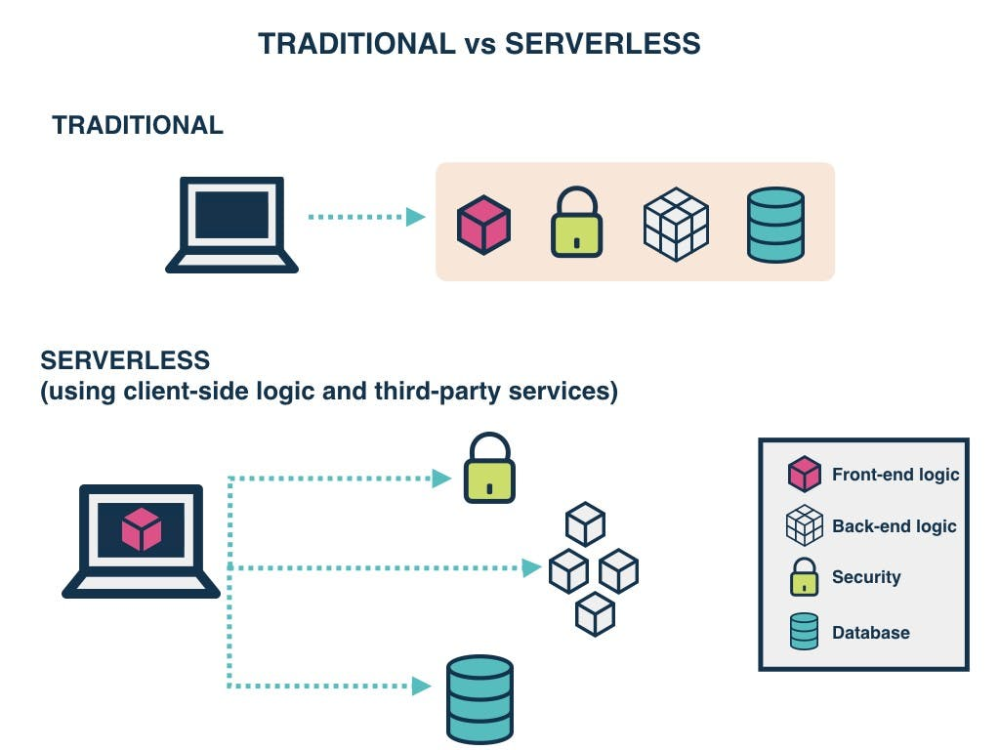

# Serverless/AWS Amplify/GraphQL

## [Intro to Serverless](https://hackernoon.com/what-is-serverless-architecture-what-are-its-pros-and-cons-cc4b804022e9)

## [AWS Amplify](https://aws.amazon.com/amplify/)

## [GraphQL Intro](https://docs.amplify.aws/cli/graphql/data-modeling/)

What makes an API RESTful?

Consulted with ChatGPT on this question:

Some of the key principals are: Client-Server Architecture, Statelessness, Cacheablility, and Uniform Interface.

> *"Client-Server Architecture: REST separates the client (user interface) and the server (data storage and processing), allowing them to evolve independently. This separation improves scalability and simplifies updates."*

Separation of user interface and the server (front end/ back end).

What is the benefit of using GraphQL? Any downsides?

Quick set up for API and database tables. You will need to make modifications.

Describe “serverless” to a new 301 Code Fellows student.

> "Serverless applications are event-driven cloud-based systems where application development rely solely on a combination of third-party services, client-side logic and cloud-hosted remote procedure calls (Functions as a Service)."

It is a cloud service that charges you based on the number of executions as opposed to pre-purchased compute capacity. Comes from a mix of third party services. This is becoming widely adopted as the maintenance of servers no longer falls on devs but on the Cloud vendors.

### Things I want to know more about

Found the concept of serverless very interesting, the article seeemed bias towards it. Interested in seeing how this plays out in the tech world moving forward.
